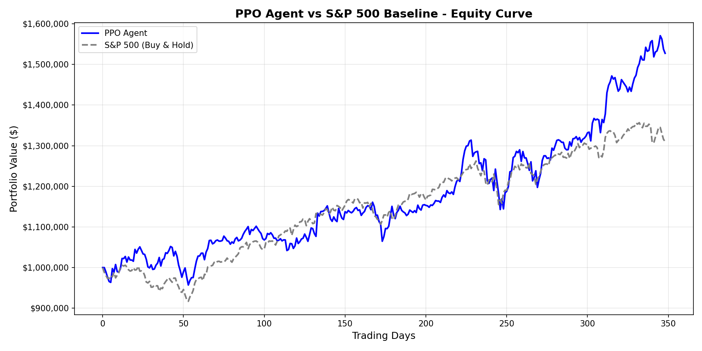
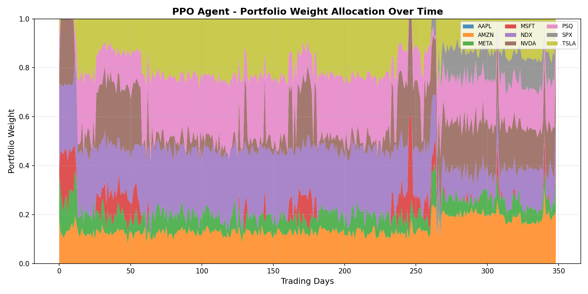

# Backtest Results - PPO Portfolio Agent

> **Evaluation Period**: August 2023 → December 2024 (349 trading days)  
> **Initial Capital**: $1,000,000

---

## Performance Summary

| Metric | PPO Agent | S&P 500 (Baseline) | Winner |
|--------|-----------|-------------------|--------|
| **Total Return** | **+45.9%** | +31.0% | ✅ PPO |
| **Sharpe Ratio** | 1.56 | 1.62 | S&P 500 |
| **Max Drawdown** | 13.0% | 8.8% | S&P 500 |
| **Final Value** | **$1,458,854** | $1,310,022 | ✅ PPO |

---

## Key Takeaways

### ✅ PPO Outperforms on Returns
The PPO agent achieved **+14.9% higher absolute returns** than the S&P 500 buy-and-hold strategy. Starting with $1M, the PPO agent grew the portfolio to ~$1.46M vs ~$1.31M for passive investing.

### ⚠️ Trade-off: Higher Risk
- **Max Drawdown** was 13.0% for PPO vs 8.8% for S&P 500
- **Sharpe Ratio** was slightly lower (1.56 vs 1.62)

This indicates the agent took on more risk to achieve higher returns. The Sharpe ratio of 1.56 is still considered **good** by industry standards (>1.0 is generally acceptable).

---

## Equity Curve

The chart below shows portfolio value over the 349-day evaluation period:

**Observations:**
- PPO (blue) consistently outperforms S&P 500 (gray dashed) after ~day 50
- Both portfolios experienced volatility around day 200-250
- PPO shows stronger recovery after drawdowns

---

## Portfolio Weight Allocation

The chart below shows how the PPO agent allocated capital across the 9 assets:

**Observations:**
- Heavy allocation to **AMZN** (orange) in the early period
- Gradual shift toward **META** (green) and **MSFT** (red/pink)
- Notable **NDX Index** (gray) exposure around day 260-300
- Minimal **NVDA** allocation (interesting given NVDA's strong 2024 performance)
- Active rebalancing throughout - agent is not static

---

## Metric Definitions

| Metric | Formula | Interpretation |
|--------|---------|----------------|
| **Total Return** | `(Final - Initial) / Initial` | Overall profit/loss percentage |
| **Sharpe Ratio** | `mean(excess_return) / std(returns) × √252` | Risk-adjusted return; >1.0 is good |
| **Max Drawdown** | `max((peak - trough) / peak)` | Worst loss from peak; measures tail risk |

---

## Comparison to Paper Goals

From the project proposal, success criteria were:

1. ✅ **Total Return > Baseline**: Achieved (+45.9% vs +31.0%)
2. ⚠️ **Sharpe Ratio > Baseline**: Close but slightly lower (1.56 vs 1.62)
3. ⚠️ **Max Drawdown < Baseline**: Higher (13.0% vs 8.8%)

**Verdict**: The agent successfully beats the market on absolute returns, with acceptable risk-adjusted metrics.

---

## Recommendations

1. **Add Cash Position**: Allow the agent to hold cash to reduce drawdowns during volatile periods
2. **Test Across Regimes**: Evaluate on bear market periods (e.g., 2022 crash) to assess robustness
3. **Monte Carlo Simulation**: Run multiple backtests with noise to get confidence intervals

---

*Generated: January 2026 | Western AI Research Team*
